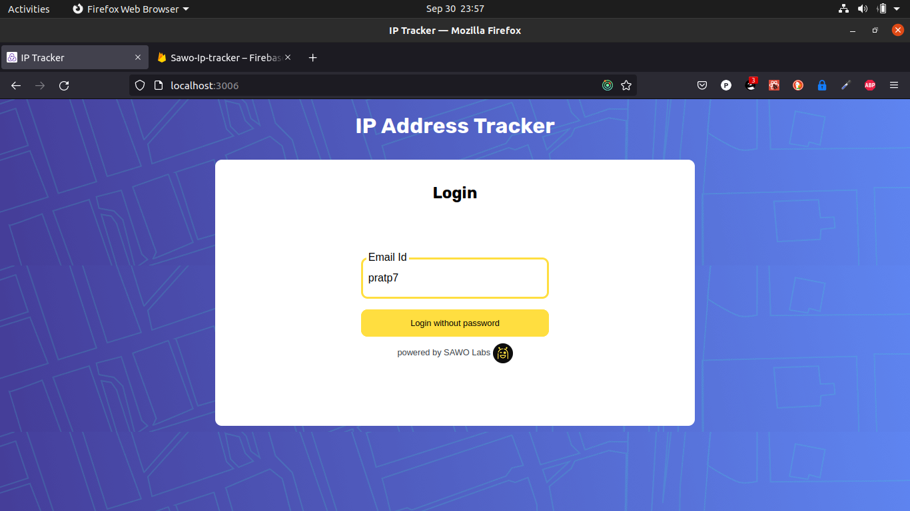
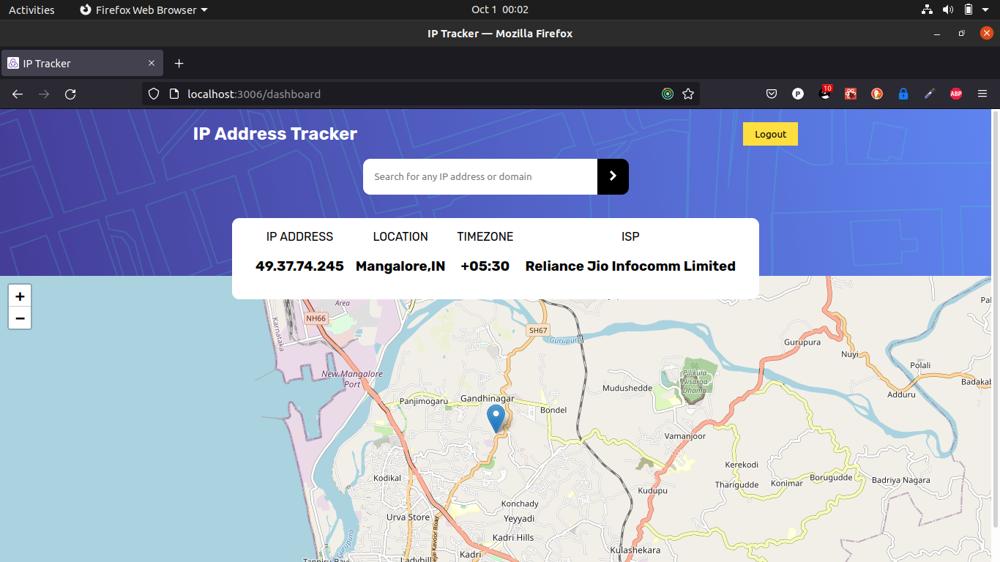
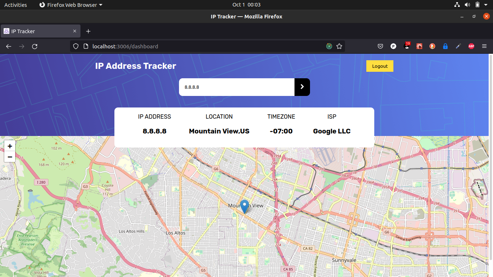
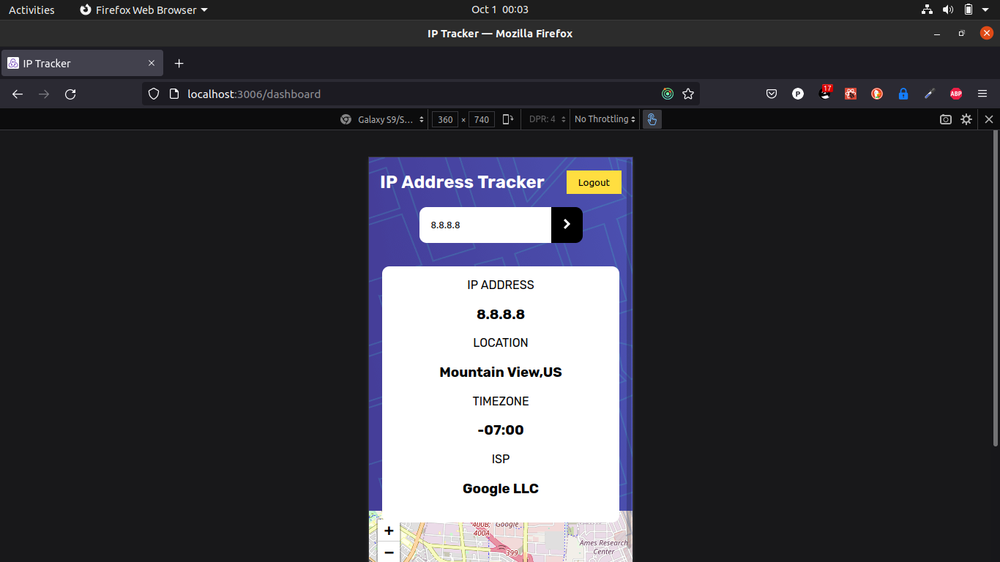

## Table of contents

- [Overview](#overview)
  - [The challenge](#the-challenge)
  - [Screenshot](#screenshot)
  - [Links](#links)
- [My process](#my-process)
  - [Built with](#built-with)
  
  ## Overview

### The challenge

Users should be able to:

- Login using SAWO sdk (the passwordless way)
- View the optimal layout for each page depending on their device's screen size
- See hover states for all interactive elements on the page
- See their own IP address on the map on the initial page load
- Search for any IP addresses or domains and see the key information and location

### Screenshot

### Links
[
- Solution URL:  https://github.com/pratp7/ip-tracker-app
- Live Site URL: https://ip-tracker-using-sawo.herokuapp.com/

## My process

### Built with

- SAWO SDK for authentication
- SCSS module properties
- Flexbox
- Leaflet for maps
- Mobile-first workflow
- [React](https://reactjs.org/) - JS library
- [SASS and CSS] - For styles
- IPify for IP address tracking

# ip-tracker-sawo
# ip-tracker
